# 一、项目功能

本项目可实现对图书借阅的综合管理。包括用户管理模块、图书管理模块、图书分类模块、图书位置模块、借阅管理模块、个人中心模块和权限设置模块以及消息提醒功能。
用户可通过在线上发起借书申请，得到管理员确认并同意后，方可线下前往借阅书籍。

## 文件功能介绍(更新中。。。。。。)

### 1、登录界面 

**login.php	login_check.php**

### 2、注册界面

**signup.php	signup_check.php**

### 3、数据库连接

**connect.php**

如果要使用自己电脑本地数据库，可以将以下字段改成本地mysql的用户名，密码，数据库
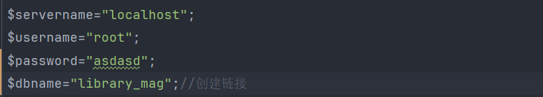

### 4、主界面 

 **head.php** **index.php** **foot.php**

#### ①图书管理模块

#### ②分类管理模块

assort_list-分类列表	assort_list_search-分类搜索	

assort_new-新增分类	assort_delete-删除分类

assort_edit-编辑分类	assort_save-数据库写入分类数据	assort_update-数据库更新数据

#### ③位置管理模块

#### ④借阅管理模块

#### ⑤用户管理模块

user_list-用户列表	user_list_search-用户搜索	

user_new-新增用户	user_delete-删除用户

user_edit-编辑用户	user_save-数据库写入用户数据	user_update-数据库更新数据

#### ⑥权限设置模块

## 数据库建表说明：每个模块的数据基本都要有一张数据表

**开发功能的时候可以随意填写数据，后面再统一**


#### **①user表：存储用户注册登录等个人数据**

补充：如果要在本地数据库创建用户表，可以使用以下sql语句
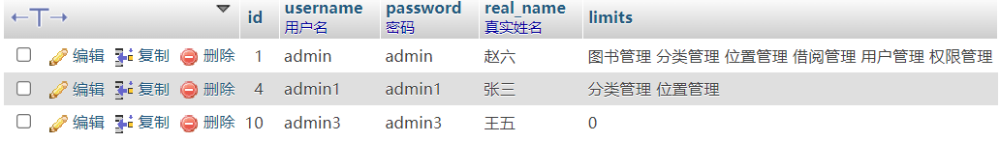

#### ②book表：存储图书数据

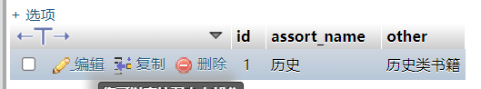


#### location表：存储图书位置管理数据

```sql
create table position
(
    id  int auto_increment,
    positionInfo char(128) not null,
    constraint position_pk
    primary key (id)
);
```
# 二、技术选型与结构设计

HTML、CSS、PHP、MySQL。
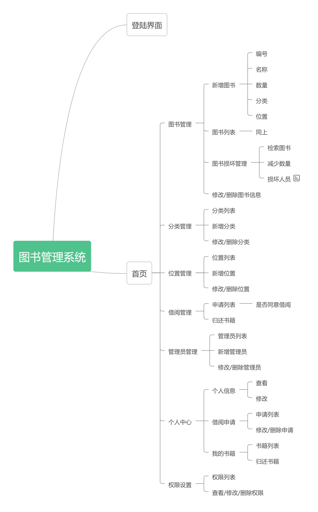

# 三、软件

https://www.jetbrains.com.cn/phpstorm/
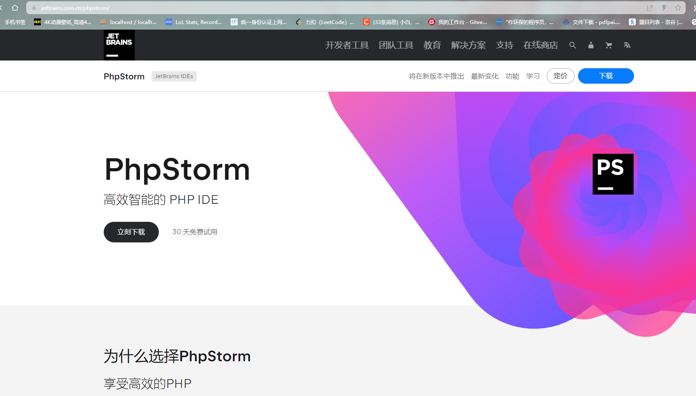


# 四、项目依赖

使用本项目需要提前下载并调用Layui的css文件和js文件（已置于本项目layui文件夹中）。
http://layui.apixx.net/

# 五、部署流程

## 下载安装PHPstudy

下载地址：https://www.xp.cn/

## 安装PHPstudy

**注意：**不要将该软件安装在含有中文字符的文件夹下。

安装完成后点击运行该软件，同时启动Apache和MySQL：
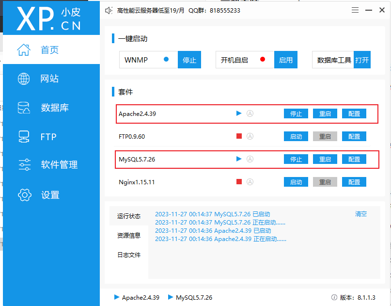


## 打开网站，确认环境部署无误

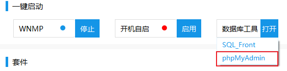

打开网站后，浏览器会默认打开这样的一个网址：

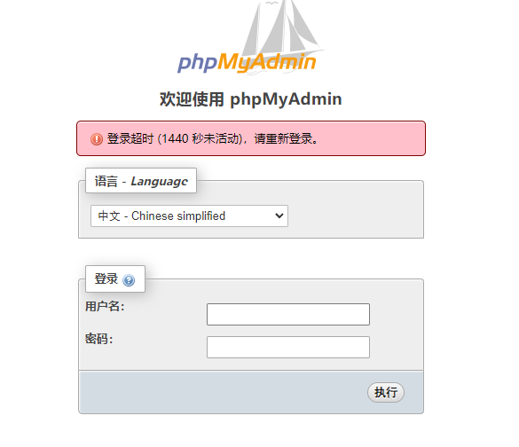

此后，访问我们自己的网站，需在浏览器中输入localhost即可访问。

账号密码：
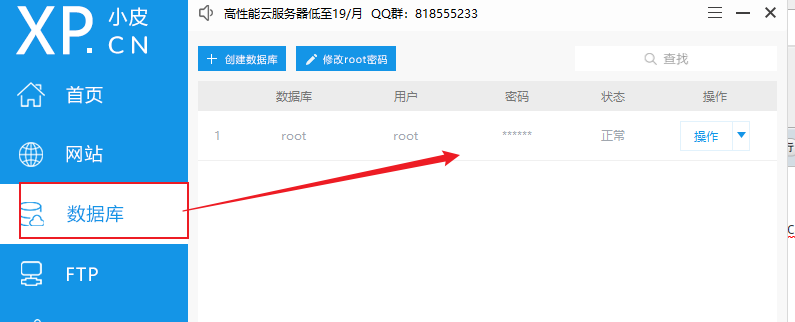

## 应用部署
将下载好文件解压，将其剪切至"WWW文件夹"：
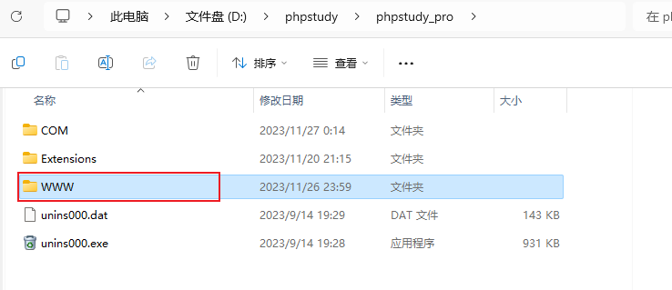

# 六、 运行项目

## 在phpstrom打开
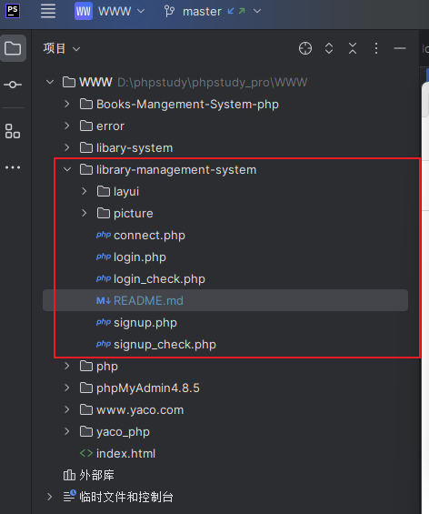


## 在浏览器输入：

http://localhost/library-management-system/login.php

就可以找到本地的登录界面

注意，一定要先打开小皮面板运行那两个套件

# 七、项目提交

**注意：自己的项目提交之前要确保仓库的代码与master分支代码保持一致**

## 1.phpstrom推送

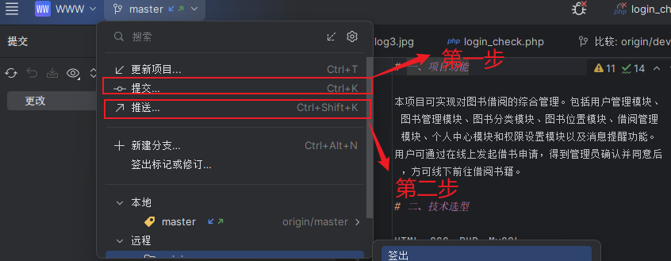

**提交远程点推送按钮**
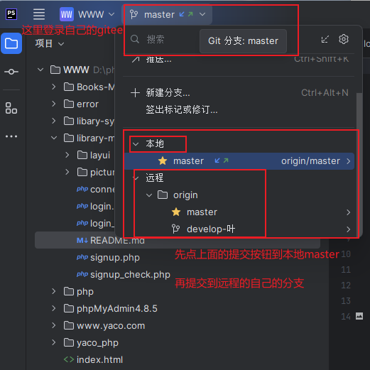

## 2.gitee合并

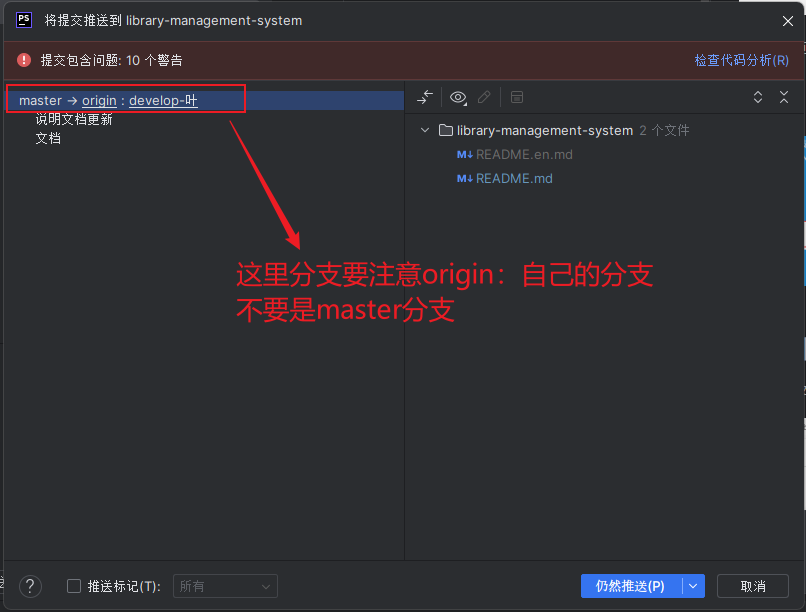
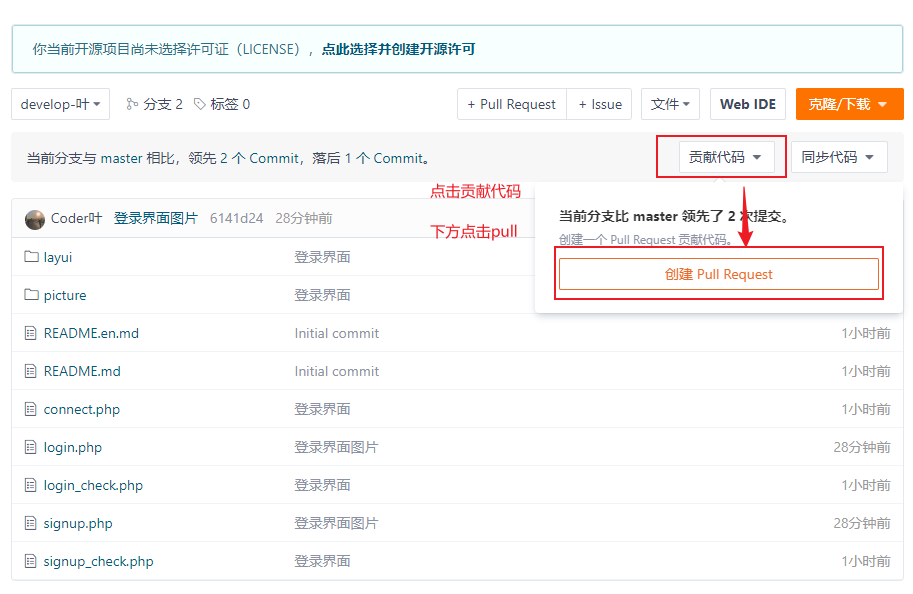

**创建标题和内容，点击推送，我来审核**